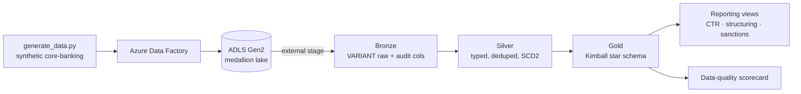
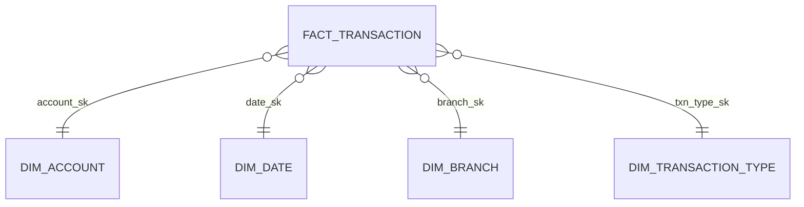
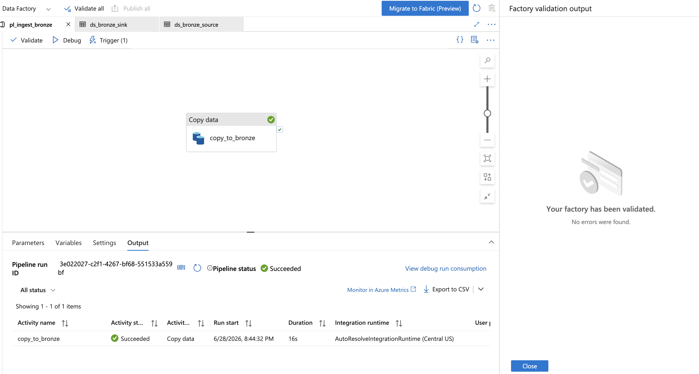
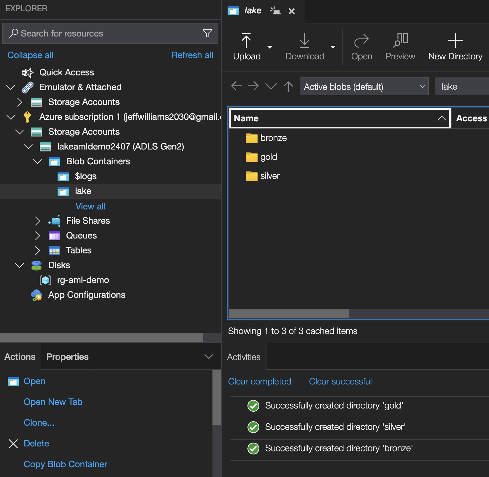
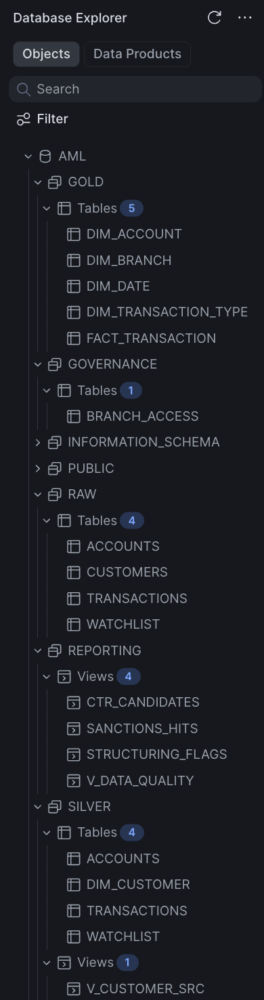
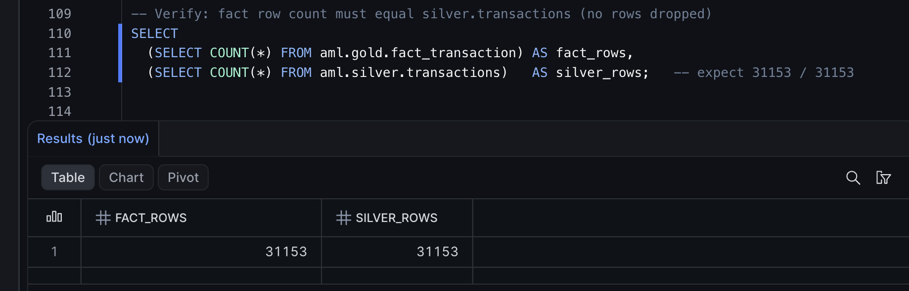
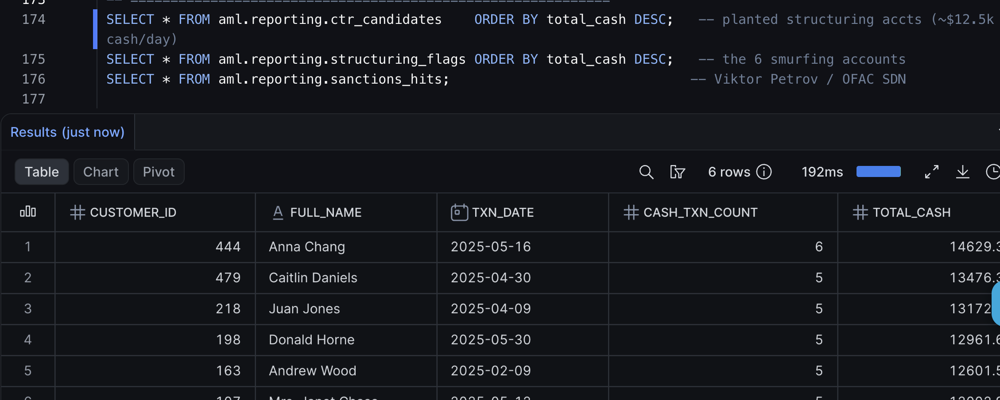
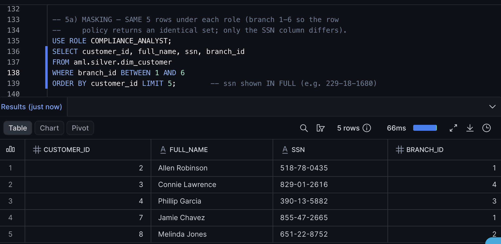
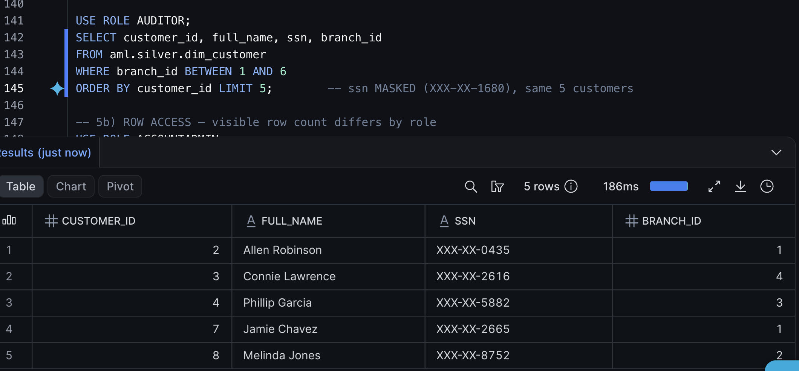
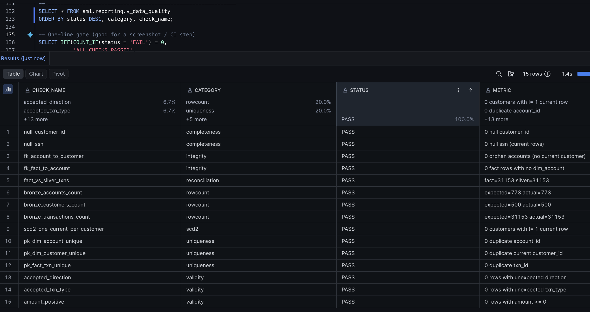

# AML Reporting Data Mart — Azure + Snowflake

An end-to-end **anti-money-laundering (AML) reporting data mart**: synthetic core-banking data
is ingested with **Azure Data Factory** into an **ADLS Gen2 medallion lake**, modeled in
**Snowflake** as a **Kimball star schema** with a Type-2 customer dimension, and served as
**governed BSA/AML reporting views** secured with role-based access, dynamic data masking, and
row-access policies.

> Built as a portfolio project to demonstrate cloud ingestion, dimensional modeling, and
> Snowflake-native data governance. All data is **synthetic** (generated locally).

**Stack:** Azure Data Factory · ADLS Gen2 · Snowflake · SQL · Python

---

## Architecture



**Why medallion?** It separates concerns: **bronze** is the immutable landing zone (schema-on-read,
so a bad file can't break ingestion), **silver** is cleaned/typed/conformed, **gold** is the
business-ready dimensional model. When something breaks, the failing layer is obvious.

| Layer | Snowflake schema | Contents |
|---|---|---|
| Bronze | `aml.raw` | Raw `VARIANT` + `_load_ts`, `_file` audit columns |
| Silver | `aml.silver` | Typed, deduplicated tables; **SCD Type-2** `dim_customer` |
| Gold | `aml.gold` | Star schema: `fact_transaction` + dimensions |
| Serving | `aml.reporting` | CTR / structuring / sanctions views + DQ scorecard |
| Governance | `aml.governance` | Masking & row-access policies, tags, role mapping |

## Data model (gold star schema)



- **Grain:** one row per transaction.
- `dim_customer` is **SCD Type 2** (`valid_from` / `valid_to` / `is_current`) so KYC/address
  changes preserve history — an investigator can see what was true *at transaction time*.
- The star build is **reconciled** against silver (`fact` rows == `silver.transactions` rows =
  **31,153**) to prove no rows were dropped in the joins.

## Reporting views (BSA/AML)

| View | Rule | Maps to |
|---|---|---|
| `ctr_candidates` | Cash credits aggregating **> $10,000 / customer / day** | Currency Transaction Report |
| `structuring_flags` | **3+ sub-$10k** cash deposits same day summing **> $10k** | Structuring / smurfing (SAR) |
| `sanctions_hits` | Customer name matches an OFAC-style watchlist | Sanctions screening |

Known patterns are seeded into the synthetic data (a 6-customer structuring ring and a planted
sanctioned individual) so detection can be verified end to end.

## Governance

- **RBAC** — three least-privilege roles: `eng` (builds pipeline, no PII), `compliance_analyst`
  (full PII, region-scoped), `auditor` (read-only, masked).
- **Dynamic data masking** — `ssn` shows in full only to compliance/admin; everyone else sees
  `XXX-XX-####`. Same query, role-dependent result — no duplicate restricted views.
- **Row-access policy** — `compliance_analyst` is scoped to its region (branches 1–6) via a
  mapping table.
- **Object tags** — `data_classification` (PII_RESTRICTED / PII / INTERNAL) for discovery.

## Data quality

`aml.reporting.v_data_quality` is a **15-check scorecard** (PASS/FAIL) covering rowcount
reconciliation, PK uniqueness, null/completeness, referential integrity, SCD2 validity, and
accepted values — re-runnable any time and used to gate the gold layer.

## Screenshots

**Ingestion — Azure Data Factory → ADLS Gen2 medallion lake**




**The mart in Snowflake**



**Modeling integrity & AML reporting**




**Governance — dynamic masking (same query, different role)**

| Compliance role — full SSN | Auditor role — masked |
|---|---|
|  |  |

**Data quality — 15-check scorecard, all PASS**



## Repo structure

```
.
├── generate_data.py              # synthetic core-banking data generator
├── sql/
│   ├── 01_setup.sql              # storage integration, external stage, file format
│   ├── 02_bronze_silver_load.sql # bronze VARIANT load + silver typed + SCD2 dim_customer
│   ├── 03_gold_star_reporting.sql# gold star schema + reporting views
│   ├── 04_governance_rbac.sql    # RBAC, masking, row-access policy, tags
│   └── 05_data_quality_checks.sql# data-quality scorecard view
└── assets/                       # curated screenshots used in this README
```

## How to run

**Prerequisites:** a Snowflake account, an Azure subscription (ADLS Gen2 + Data Factory),
Python 3.10+.

1. **Generate data:** `python generate_data.py` → writes Parquet files (customers, accounts,
   transactions, watchlist).
2. **Land it in ADLS Gen2** under a `bronze/` prefix (via the ADF pipeline, or manual upload to
   start).
3. **Run the SQL in order** (as `ACCOUNTADMIN`) in a Snowflake worksheet:
   - `01_setup.sql` — storage integration + external stage (complete the Azure consent step)
   - `02_bronze_silver_load.sql` — load bronze, build silver + SCD2
   - `03_gold_star_reporting.sql` — build the star schema + reporting views
   - `04_governance_rbac.sql` — roles, masking, row-access, tags
   - `05_data_quality_checks.sql` — build and run the DQ scorecard
4. **Verify** with the test blocks in each file (rowcounts, masked-vs-unmasked, scorecard).

> Tip: for least-privilege tests, run `USE SECONDARY ROLES NONE;` — Snowsight defaults to
> unioning all your roles, which otherwise leaks admin access into role tests.

## Possible extensions

- Incremental load with **Streams + Tasks** (or Dynamic Tables) instead of full refresh.
- **Point-in-time-correct** branch on the fact (join the SCD2 row valid at `txn_date`).
- Promote `dim_customer` into `gold` for a pure-gold star.
